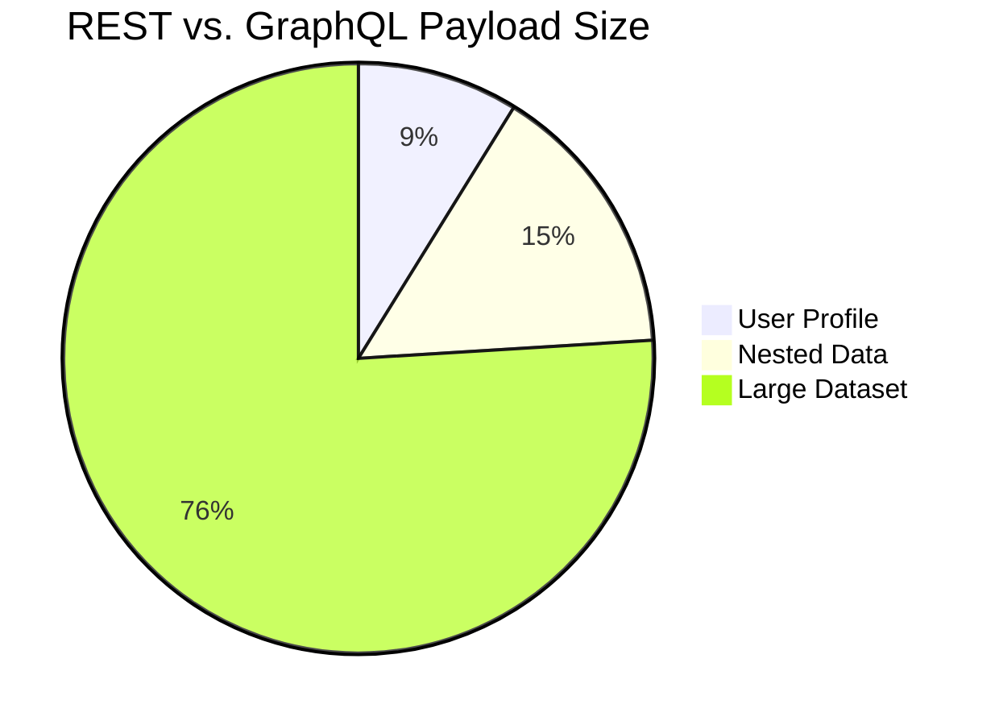
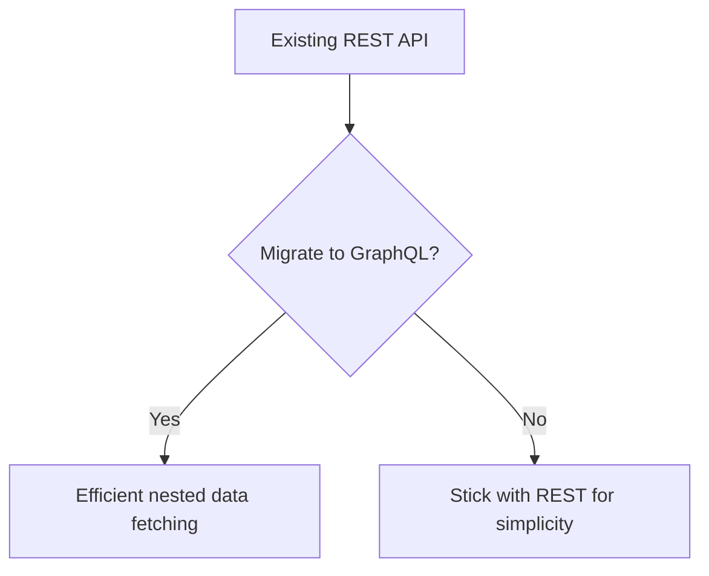
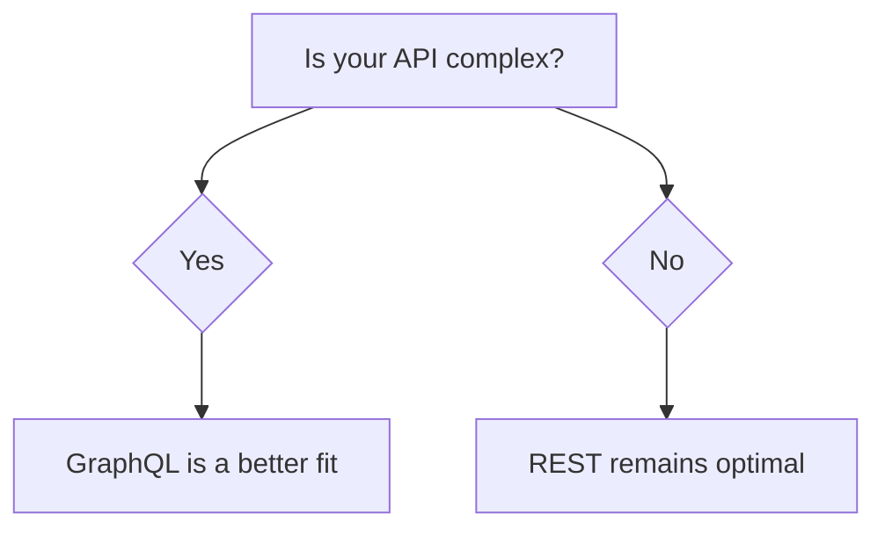

# Should You Migrate from REST to GraphQL? What to Consider

In the world of API development, choosing between **REST** and **GraphQL** often comes down to balancing flexibility, performance, and developer experience. While REST has been the dominant architecture for decades, GraphQL’s rise has sparked debates about whether to migrate from REST to this query language. Let’s break down the key factors to consider before making the leap.

---

## Key Considerations: REST vs. GraphQL

### 1. **Performance and Payload Efficiency**

REST APIs typically require multiple requests to fetch nested data, leading to over-fetching or under-fetching. GraphQL allows clients to request _exactly_ what they need, reducing payload size and network latency.

**Example**:  
A REST API for a user profile might require three requests to get user data, avatar, and posts. With GraphQL, a single query can fetch all required data in one go.

**Mermaid Chart: Payload Comparison**

### 2. **Scalability and Caching**

GraphQL’s flexibility can complicate caching strategies, as queries are dynamic. REST APIs benefit from standardized cache headers (e.g., `Cache-Control`). However, tools like Apollo Server’s caching layer or Redis can mitigate GraphQL’s challenges.

### 3. **Security and Complexity**

GraphQL exposes a single endpoint, requiring robust permission checks to prevent data leakage. REST APIs often use multiple endpoints with built-in authentication (e.g., OAuth).

### 4. **Developer Experience**

GraphQL’s strong typing and introspection features make it easier to debug and document APIs. REST relies on consistent naming conventions and external documentation (e.g., Swagger).

---

## When to Migrate: A Scenario-Based Analysis

Let’s compare migration benefits across use cases.

| **Use Case**              | **REST**                      | **GraphQL**                 |
| ------------------------- | ----------------------------- | --------------------------- |
| Simple CRUD APIs          | ✅ Fast to implement          | ⚠️ Overhead in setup        |
| Complex nested data       | ⚠️ Requires multiple requests | ✅ Single query             |
| Frequent frontend changes | ⚠️ API versioning needed      | ✅ Schema evolution         |
| High traffic APIs         | ✅ Caching-friendly           | ⚠️ Requires careful caching |

**Mermaid Chart: Migration Use Cases**

---

## Case Studies and Industry Stats

- **Adoption Trends**: According to a 2023 survey by **GraphQL Foundation**, 45% of developers reported using GraphQL in production, up from 20% in 2020.
- **Performance Gains**: A case study by **Shopify** showed GraphQL reduced payload sizes by 30–50% compared to REST, improving load times.
- **Challenges**: 60% of teams faced performance bottlenecks when migrating, often due to unoptimized queries or lack of caching.

---

## Challenges and Best Practices

1. **Migration Complexity**

   - **Challenge**: Refactoring existing REST endpoints and ensuring backward compatibility.
   - **Solution**: Use tools like [Postman](https://www.postman.com/) or [GraphiQL](https://github.com/graphql/graphiql) to test queries incrementally.

2. **Caching and Performance**

   - Implement caching layers (e.g., Redis) and use directives like `@cacheControl` in Apollo Server.

3. **Security Risks**

   - Enforce strict permission checks using middleware and avoid exposing sensitive fields.

4. **Team Training**
   - Invest in training to familiarize developers with GraphQL’s query language and schema design.

---

## Final Takeaway: Migrate Strategically

Migrating from REST to GraphQL is not a one-size-fits-all decision. It’s ideal for:

- APIs needing **nested or dynamic data**.
- Teams prioritizing **developer experience** and tooling.
- Projects with high frontend flexibility but **complex data requirements**.

However, avoid migrating if:

- Your API is simple and requires minimal changes.
- You lack the resources to handle caching, security, or performance tuning.

**Mermaid Chart: Migration Decision Matrix**

---

## Conclusion

Both REST and GraphQL have strengths. While GraphQL offers unparalleled flexibility and efficiency for modern applications, its success hinges on proper planning, caching strategies, and team readiness. Use the decision matrix above to evaluate your use case — and remember: **migrate with purpose, not just for the trend**.

---

**🚀 Let’s build something amazing! If you have a project in mind or need help with your next design system, feel free to reach out.**  
📧 Email: [safi.abdulkader@gmail.com](mailto:safi.abdulkader@gmail.com) | 💻 LinkedIn: [@abdulkader-safi](https://www.linkedin.com/in/abdulkader-safi/) | 📱 Instagram: [@abdulkader.safi](https://www.instagram.com/abdulkader.safi/) | 🏢 [DSRPT](https://www.dsrpt.com.au/kw/contact)

_Drop me a line, I’m always happy to collaborate!_ 🚀
